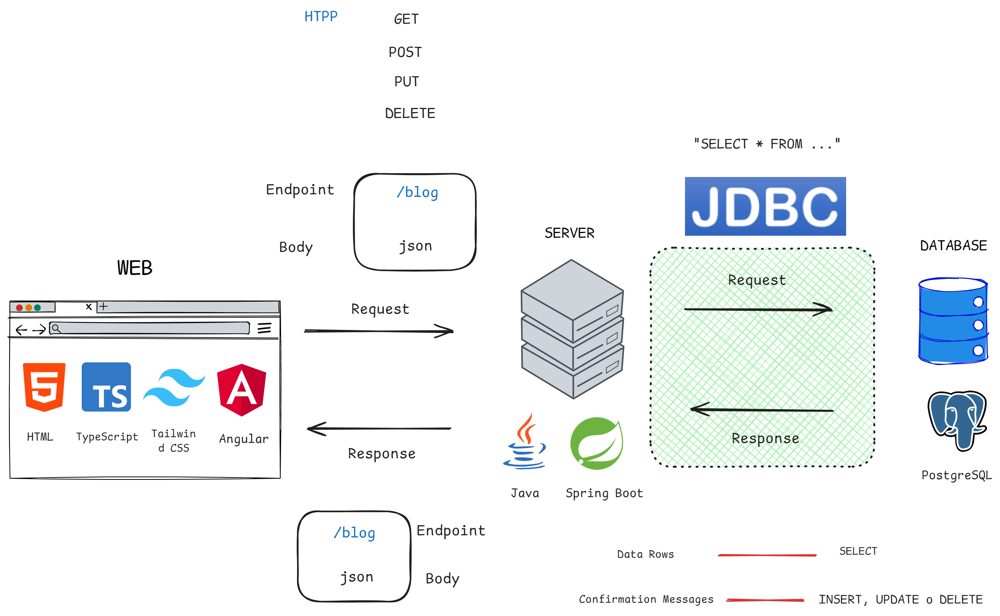
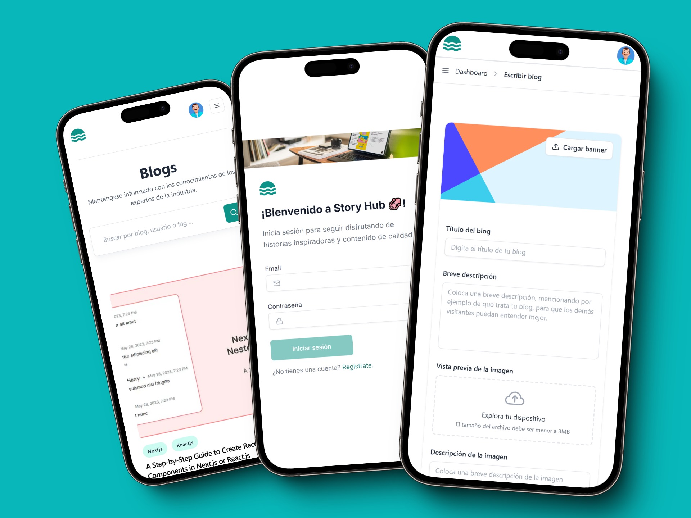
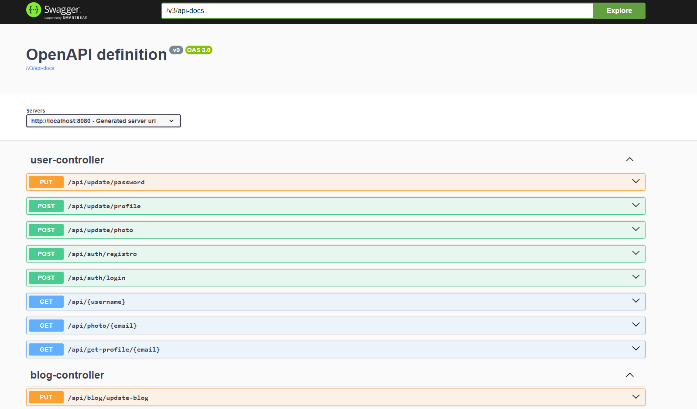

# <h2 align="center"> 💬 Story Hub - Backend 📝 </h2>

### ARQUITECTURA



### UI


## Descripción del Proyecto

Story Hub es una plataforma de publicación de blogs similar a Medium, diseñada para permitir a los usuarios crear, editar, y publicar artículos. Este repositorio contiene el código backend de la aplicación, construido con **Java** y **Spring Boot**. El backend se encarga de gestionar la lógica de negocio y el acceso a la base de datos, que está alojada en **PostgreSQL**.

El proyecto está estructurado en tres módulos principales:

- **Users:** Gestión de usuarios y autenticación.
- **Blog:** Creación, edición, y eliminación de publicaciones.
- **Comments:** Gestión de comentarios en las publicaciones.

El backend está desplegado en **Railway**, una plataforma que permite la fácil gestión y escalabilidad de servidores backend.

## Estructura del Proyecto

El backend sigue la arquitectura de **tres capas (Controller, Service, Repository)**:

- **Controller:** Se encarga de manejar las solicitudes HTTP y enviar respuestas adecuadas al cliente.
- **Service:** Contiene la lógica de negocio de la aplicación.
- **Repository:** Realiza operaciones CRUD con la base de datos utilizando **JDBC**.

## Despliegue y Tecnologías Utilizadas

- **Railway:** Plataforma para el despliegue del backend.
- **PostgreSQL:** Base de datos utilizada para almacenar la información de usuarios, publicaciones, y comentarios.
- **JDBC:** Para la interacción con la base de datos.
- **Swagger:** Para documentar y probar las APIs.

## Documentación API con Swagger



Para facilitar la comprensión y el uso de nuestras APIs, he implementado **Swagger**. Swagger genera automáticamente una interfaz de usuario donde puedes visualizar y probar todas las rutas disponibles.

Una vez el servidor está en funcionamiento, puedes acceder a la documentación de Swagger en:
`http://localhost:8080/swagger-ui/index.html`


Desde ahí podrás interactuar con las APIs directamente desde el navegador, sin necesidad de usar herramientas externas.

## Testeo de APIs con Postman


Además de Swagger, también he utilizado **Postman** como herramienta de prueba para las APIs. Postman permite realizar solicitudes HTTP a las diferentes rutas de la API, permitiendo testear su comportamiento en diferentes escenarios.

Postman es ideal para probar manualmente las operaciones de CRUD (Crear, Leer, Actualizar y Eliminar) y verificar el formato de los datos devueltos por las APIs, facilitando la depuración y el desarrollo incremental.

## Ejecución del Proyecto Localmente

Para correr el backend de manera local, sigue los siguientes pasos:

1. Clona este repositorio:
   ```bash
   git clone https://github.com/AnthonyAvellaneda10/story-hub.git
   cd story-hub

2. Configura las variables de entorno dentro del `application.properties`.

3. Ejecuta la aplicación:
```bash
./mvnw spring-boot:run
```

4. La aplicación estará disponible en `http://localhost:8080/**` y podrás probarla con las rutas específicas de la API a través de Postman.

